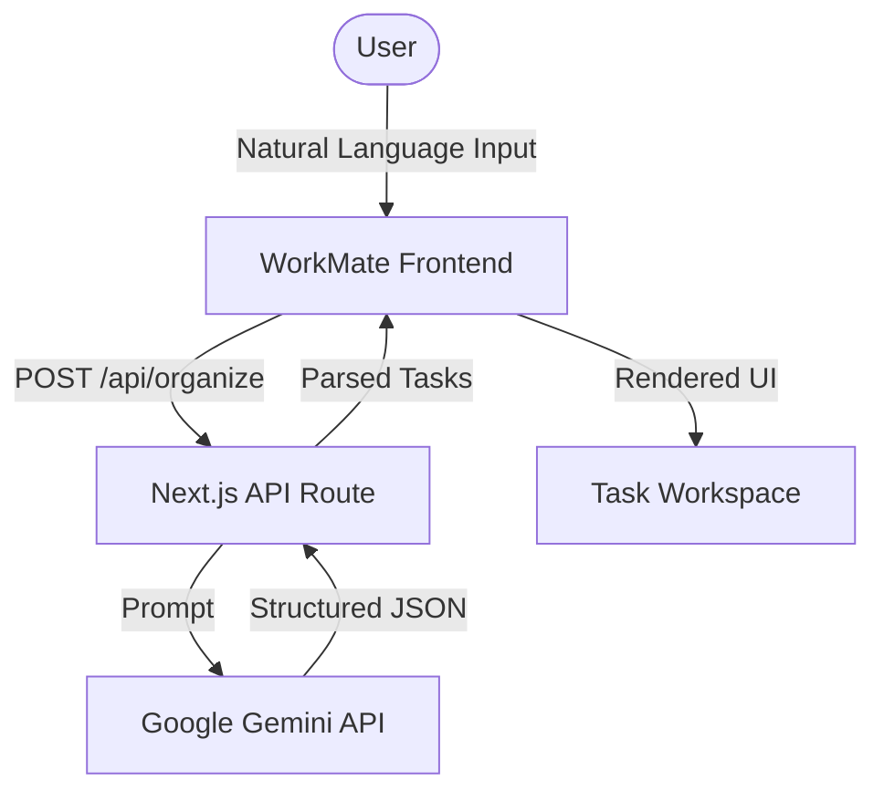

# WorkMate

**Turn messy work into clear action.**

WorkMate is an AI-powered workspace that transforms unstructured business instructions into organized, actionable tasks.

<!-- HERO: Add a WorkMate dashboard screenshot or short demo GIF here -->

## The Problem

Small-business work rarely arrives neatly organized. It comes in as scattered communication:

- Customer texts and requests
- Payment follow-ups
- Order instructions
- Natural-language deadlines

> *"Ahmed needs 3 blue shirts tomorrow. Sara hasn't paid yet. Post the new collection tonight."*

The problem isn't a lack of information—it's that the information is entirely unstructured. Work gets lost between communication and execution.

## The Idea

WorkMate acts as the bridge.

```text
Messy work
    ↓
AI understands
    ↓
Structured action
```

## How It Works



## Example Transformation

**Input:**
> *"Ahmed needs 3 blue shirts tomorrow. Sara hasn't paid yet. Post the new collection tonight."*

**Output:**
- Fulfill Ahmed's order — **High** — Tomorrow
- Follow up with Sara about payment — **Medium** — No deadline
- Post the new collection — **Normal** — Tonight

*(Illustrative example. Priority and deadline extraction may vary.)*

<!-- TRANSFORM: Add AI transformation screenshot here -->

## The Workspace

The dashboard transforms unstructured input into a premium, actionable control center.

- **Intelligent Cards**: Automatically detected priorities, categories, and deadlines.
- **Continuous Flow**: Seamlessly append new tasks to your ongoing session.
- **Start Fresh**: Clear the board instantly when you need a new session.
- **Persistence**: Preserves workspace state across browser refreshes using `localStorage`.

<!-- WORKSPACE: Add WorkMate dashboard screenshot here -->

## Communication Assistant

Turn customer messages into ready-to-send replies.

1. Paste a customer message
2. Choose a tone (Friendly, Professional, or Casual)
3. Generate a ready-to-send response

<!-- COMMS: Add Communication Assistant screenshot here -->

## Design Philosophy

WorkMate uses a dark cinematic interface heavily inspired by modern AI command centers. 

- Deep glass and subtle depth effects
- Strong typography hierarchy
- Glowing priority indicators
- Fluid visual transformations via Framer Motion

---

## Tech Stack

| Category | Technology |
|---|---|
| **Frontend** | Next.js 16, React 19, TypeScript |
| **Styling** | Tailwind CSS v4 |
| **Motion** | Framer Motion |
| **AI** | Google Gemini API (`@google/genai`) |
| **Icons** | Lucide React |

## Project Structure

```text
frontend/
├── app/
│   ├── api/
│   │   ├── organize/route.ts   # Gemini task extraction
│   │   └── reply/route.ts      # Gemini comms assistant
│   ├── activity/
│   ├── messages/
│   ├── tasks/
│   ├── globals.css
│   ├── layout.tsx
│   └── page.tsx                # Main workspace dashboard
├── components/
│   ├── ui/
│   │   ├── AIProcessing.tsx
│   │   ├── AnimatedBackground.tsx
│   │   ├── DashboardMetrics.tsx
│   │   ├── IntroSequence.tsx
│   │   └── TaskCard.tsx
│   └── Navbar.tsx
└── lib/
    └── types.ts
```

## Getting Started

1. **Clone & Install:**
   ```bash
   git clone https://github.com/areebamuhammad/WorkMate.git
   cd WorkMate/frontend
   npm install
   ```

2. **Environment Configuration:**
   Create `.env.local` and add your Gemini API key (accessed purely server-side):
   ```env
   GEMINI_API_KEY=your_gemini_api_key_here
   ```

3. **Run Development Server:**
   ```bash
   npm run dev
   ```

## API Reference

### `POST /api/organize`
Converts messy business instructions into structured JSON task arrays.

### `POST /api/reply`
Generates a contextual customer reply from a provided message and selected tone.

## Security & Architecture

- **Server-Side AI:** Gemini API credentials are never exposed to the client.
- **Git Exclusion:** `.env.local` is strictly excluded from version control.
- **Local Persistence:** Tasks are persisted locally in browser `localStorage`.
- *Note:* Avoid entering highly sensitive or confidential information into this prototype.

## Current Limitations & Future Direction

WorkMate is currently a hackathon MVP prototype. 
- **Current constraints:** Browser-local persistence only. No external calendar/email integrations, automated notifications, or authentication.
- **Future direction:** Potential integration with calendars, multi-user collaboration, richer task editing, and business analytics.

## Hackathon

Built for the **Global Innovation Build Challenge V2**.

## License

License information has not yet been added.

## AI-Assisted Development

WorkMate was developed transparently with AI assistance, utilizing tools like ChatGPT and Antigravity for planning, coding assistance, and technical support. Core product direction, feature selection, testing, and final iteration were entirely directed by the developer.

## Acknowledgments

Built using the incredible foundations provided by Google Gemini, Next.js, React, Tailwind CSS, and Framer Motion.
